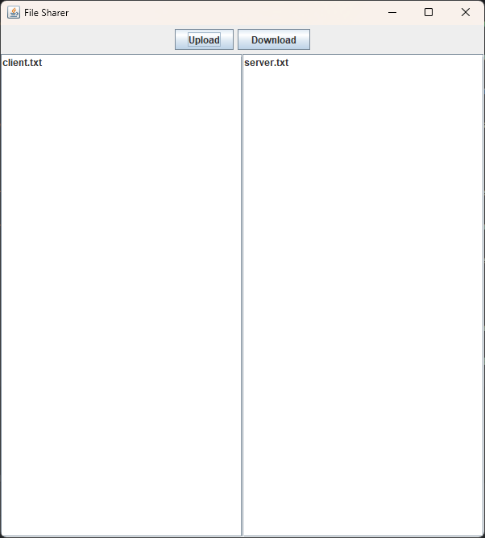

# Assignment 2 - File Sharing System
CSCI 2020U: System Development and Integration

## Overview

You and your roommates have decided that you want your own file sharing system, so you decide to write  it yourselves. The file sharing system will expose a directory of files on the server to the clients directly. 

## Primary Instructions

The file sharing clients will connect to a central server, which will respond to a single client command, and  then disconnect. Each time the client needs to issue another command, it will reconnect before sending the command. The server will respond to the following commands:
- `DIR`
  - Returns a listing of the contents of the shared folder, on the server’s machine
  - The server will disconnect immediately after sending the list of files to the client
- `UPLOAD filename`
  - Immediately after the newline after this command will be the contents of a text file
  - The server will connect the text from this text file, and save it as a new file filename
  - The server will disconnect immediately after saving the text file’s contents
- `DOWNLOAD filename`
  - The server will load the text from the text file filename, and will immediately send that  text to the client and disconnect

### Server
The server does not need to have any user interface, but it must be multi-threaded. Each incoming client  connection should be handled with a separate thread (`ClientConnectionHandler`). This thread,  and its corresponding socket, will remain open only until the command has been handled.

### Client
The client will have a simple user interface. When the client is started, the computer name and shared  folder path are passed as command-line arguments. The client will then show a split screen showing two
lists (`Jlist`). Both lists will consist of filenames. On the left will be the list of all files in the shared folder of the  local client. On the right will be the list of files in the shared folder of the server.

>Note: No mechanism for navigating to sub-folders is required for this assignment. It can be presumed that  only text files, not directories or binary files, can be in the shared folder.

At the top of the window will be two buttons. A `DOWNLOAD` button, when clicked, will cause the file  selected in the right list to transfer from the remote server’s shared folder to the local client’s shared  folder. This transfer will simply be a copy of every character in the file across the network.  

An `UPLOAD` button will facilitate a transfer in the other direction (copying a file from the client’s local  shared folder to the server’s remote shared folder). As with downloads, the upload will consist of a  transfer of every character in the file.

When an `UPLOAD` or `DOWNLOAD` occurs, the user interface will need to refresh both lists of files to show  the newly uploaded or downloaded file. 

    

## Secondary Instructions

- **The UI and system.** While the figure shows the most basic version of your UI for the File Sharear; you are expected to put effort into improving the aesthetics of the screen. Example: What if you could configure your shared folder graphically, instead of merely setting a  variable? Display the file’s content? Can you think of any way to improve the file sharing system? What if you could navigate to sub-directories  in a shared folder? Password protected files?

- **README.md.** Make sure your project includes a `README.md` file containing the following sections:

  - Project information: short textual description of your project, and at least one screenshot of your application running.

  - Improvements: briefly describe the improvements you made to the interface and/or the system (if any).

  - How to run: step-by-step information on how one can successfully clone and run your application.

  - Other resources: any references to other materials/libraries that you might have used on your solution.

 > Feel free to create other helper classes as you see fit.
 
